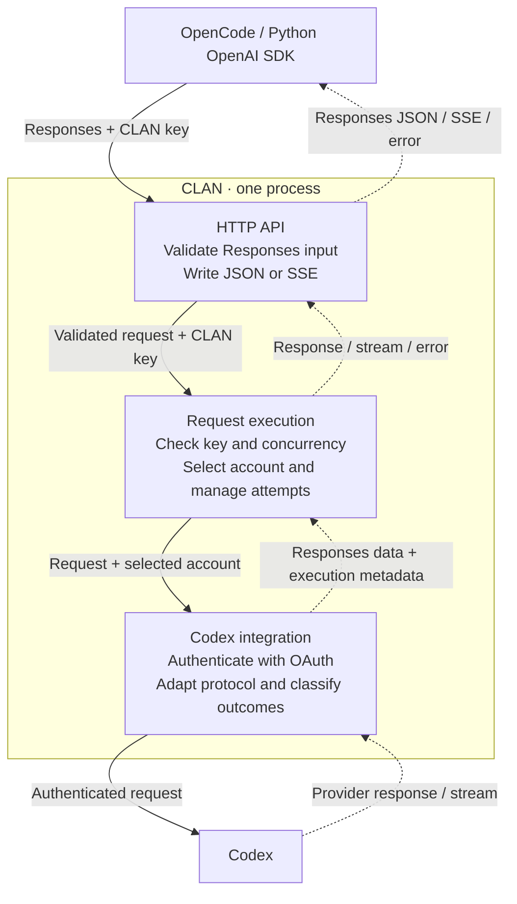

<div align="center">



<p><strong>A self-hosted gateway that turns your Codex subscriptions into one OpenAI Responses endpoint with named, revocable keys.</strong></p>

[](https://github.com/deyna256/clan/actions/workflows/ci.yml)
[](go.mod)
[](LICENSE)
[](#first-release)

[Quick start](#quick-start) · [First release](#first-release) · [How it works](#request-flow) · [Docs](#documentation) · [Contributing](CONTRIBUTING.md)

</div>

---

> [!IMPORTANT]
> CLAN is an independent project and is not affiliated with OpenAI. Connect only
> accounts you are allowed to use, and make sure the way you share access follows
> your provider's terms.

## Why CLAN

<table>
<tr>
<td width="50%" valign="top">

**🔌 One endpoint for every client**<br>
Point OpenCode or the OpenAI SDK at CLAN's `/v1` base URL. Apps and teammates use
CLAN keys instead of personal credentials.

</td>
<td width="50%" valign="top">

**🔄 Several accounts act as one**<br>
Connect Codex accounts through browser OAuth. Requests go round-robin to accounts
that serve the model; accounts that hit provider limits sit out until they recover.

</td>
</tr>
<tr>
<td valign="top">

**🔑 Access you can take back**<br>
One named key per app or person, each with a concurrency limit; a full key gets an
immediate `429`. Revoking a key cancels its running requests at once.

</td>
<td valign="top">

**🌊 Faithful responses**<br>
JSON or SSE with event order, function calls, argument fragments and encrypted
reasoning preserved. The terminal status is explicit; CLAN never invents a completion.

</td>
</tr>
<tr>
<td valign="top">

**🔒 Secrets stay secret**<br>
OAuth tokens are encrypted with AES-256-GCM, and client keys are stored as hashes.
Credentials and request content never appear in logs.

</td>
<td valign="top">

**📦 Nothing else to run**<br>
One Go binary and one SQLite file, with no CGO, Redis or web panel. Accounts and keys
are managed through an admin API with an OpenAPI schema.

</td>
</tr>
</table>

### Principles

- **Free and open forever:** every feature is open source, with no paid tiers or
  proprietary editions.
- **Small working scope:** finish the supported client scenarios before adding
  protocols, tools or infrastructure.
- **Predictable behavior:** keep the meaning of supported requests, retry only when
  safe and reject unsupported options explicitly.
- **Clear failures:** report safe error details and keep unknown usage distinct
  from zero.

## Quick start

You need Docker with Compose, [`just`](https://github.com/casey/just), `openssl` and
a Codex subscription. To run without Docker, see [Running CLAN](docs/running.md).

**1. Configure and start the gateway.** Put two secrets in `.env` and keep them
private. Restarts need the same encryption key, otherwise stored credentials cannot
be read.

```sh
git clone https://github.com/deyna256/clan && cd clan
cp .env.example .env      # set CLAN_ADMIN_TOKEN and CLAN_ENCRYPTION_KEY
just build && just run    # serves 127.0.0.1:8080; data stays in the clan_data volume
set -a; . ./.env; set +a  # load the admin token into this shell
```

**2. Connect a Codex account.** Start a login, then open the returned
`authorization_url` in your browser.

```sh
curl http://127.0.0.1:8080/api/oauth/login \
  -H "Authorization: Bearer $CLAN_ADMIN_TOKEN" \
  -H 'Content-Type: application/json' \
  -d '{"name":"Primary"}'
```

**3. Create a client key.** Save the returned `key`: CLAN shows it only once.

```sh
curl http://127.0.0.1:8080/api/client-keys \
  -H "Authorization: Bearer $CLAN_ADMIN_TOKEN" \
  -H 'Content-Type: application/json' \
  -d '{"name":"My laptop","concurrency_limit":3}'
```

**4. Generate.** Use any model ID from `GET /v1/models`.

```python
from openai import OpenAI

client = OpenAI(base_url="http://127.0.0.1:8080/v1", api_key="<CLAN key>", max_retries=0)
reply = client.responses.create(model="MODEL_ID", input="Say hello.", store=False)
print(reply.status, reply.output_text)
```

Check `status` before using the output: HTTP 200 also covers `incomplete` and
`failed` responses. [Running CLAN](docs/running.md) covers configuration, remote
sign-in and shutdown. The [client contract](docs/client-contract.md#opencode) has
the OpenCode configuration.

## First release

The gateway runs end to end in Docker or from source. Acceptance checks with real
clients remain before the release.

| Area | Scope | Status |
|---|---|---|
| Clients | OpenCode and Python applications using the OpenAI SDK | 🚧 acceptance checks, [#36](https://github.com/deyna256/clan/issues/36) |
| Client API | `POST /v1/responses` for generation; `GET /v1/models` for available models | ✅ |
| Integration | Codex subscription access through built-in OAuth sign-in | ✅ |
| Generation | Text, instructions, client-supplied history, image input including screenshots, JSON and JSON Schema output, reasoning settings and continuation data | ✅ images and reasoning replay not yet checked live |
| Tools | Function definitions, calls, JSON argument fragments and results; tools run in the client | ✅ some `tool_choice` modes not yet checked live |
| Responses | Complete JSON responses and SSE streaming | ✅ |
| Accounts | One or more Codex accounts; round-robin for the requested model; temporarily exclude accounts with exhausted provider limits | ✅ |
| Client access | Separate named keys for applications or people, with shared access to connected accounts and available models | ✅ |
| Limits | Concurrent requests per key, with immediate rejection when full | ✅ |
| Management | HTTP JSON API under `/api`, protected by a separate admin token | ✅ |
| Storage | SQLite for accounts, encrypted OAuth credentials, access-key hashes and settings | ✅ |
| Diagnostics | Structured JSON logs with outcomes, safe errors, account switches and known token usage | ✅ |
| Deployment | One Go process or container per installation | ✅ |

✅ implemented · 🚧 in progress. Live checks against Codex are recorded in the
[client contract](docs/client-contract.md#checks-so-far).

Clients send the full conversation history with each request. CLAN does not store
responses or support continuation through `previous_response_id`. For Codex
compatibility, CLAN removes `max_output_tokens` and logs a warning, so the requested
output limit is not enforced.

Revoking a client key blocks new requests and cancels its active requests. Retries
keep the same concurrency slot, and resources are closed before the slot is released.
Known token usage is diagnostic data, not a token budget. The
[architecture](docs/architecture.md) defines management operations, OAuth setup and
remaining integration checks.

<details>
<summary><strong>Outside the first release</strong></summary>

- Chat Completions, Anthropic and Gemini APIs; other upstream integrations and
  API-key authentication to providers.
- Provider-native tools (web search, code execution, image generation and hosted
  MCP), custom/freeform tools, namespaces and tool search.
- WebSocket, background generation, stored responses, Conversations, Files,
  Containers, Vector Stores and separate compact/count operations.
- Per-key account/model permissions, RPM limits, token or monetary budgets,
  database request history and usage reports.
- PostgreSQL, multiple active gateway instances, a web panel, auth-file imports
  and additional OAuth connection methods.

These exclusions do not commit the project to a later delivery date.

</details>

## Request flow

This diagram shows runtime flow inside one process, not Go package dependencies.
Solid arrows carry requests; dashed arrows carry responses.



Responses is the reference content format. Execution uses small metadata values
without parsing messages or tool arguments. The Codex integration handles protocol
differences; there is no separate universal message or event model.

## Documentation

| I want to… | Read |
|---|---|
| Start the gateway and connect an account | [Running CLAN](docs/running.md) |
| Connect OpenCode or the Python SDK and check compatibility | [Client contract](docs/client-contract.md) |
| Manage accounts, client keys and model lists | [Management API](docs/management-api.md) |
| Understand modules, management and open questions | [Architecture](docs/architecture.md) |
| Write and review Go code and tests | [Development guide](docs/development.md) |
| Open an issue or PR, or update documentation | [Contributing](CONTRIBUTING.md) |
| Check community rules | [Code of Conduct](CODE_OF_CONDUCT.md) |

<details>
<summary><strong>Decision log</strong></summary>

These are accepted design decisions. Their status does not imply implementation.

| Decision | Covers |
|---|---|
| [Use Go](docs/decisions/0001-use-go.md) | Application language |
| [Use Responses as the content format](docs/decisions/0002-use-responses-as-content-format.md) | Responses content and small execution metadata |
| [Separate execution from protocols](docs/decisions/0003-separate-request-execution-from-protocols.md) | Attempt ownership, concurrency, cancellation and streaming |
| [Use SQLite](docs/decisions/0007-use-sqlite.md) | Persistent configuration and secret storage |
| [Use chi](docs/decisions/0014-use-chi-for-http-routing.md) | HTTP routing over `net/http` |

</details>

**Built with** Go and `net/http`, [chi](https://github.com/go-chi/chi) for routing,
[Huma](https://github.com/danielgtaylor/huma) for the management OpenAPI contract and
[modernc SQLite](https://gitlab.com/cznic/sqlite).

## Contributing

Issues and pull requests are welcome. Read [CONTRIBUTING.md](CONTRIBUTING.md) for
the issue format, branch and commit rules, and the checks to run. Working notes
belong in the ignored `.local/` directory; see
[local working documents](CONTRIBUTING.md#local-working-documents).

## License

[MIT](LICENSE) © 2026 Ivan Deyna
