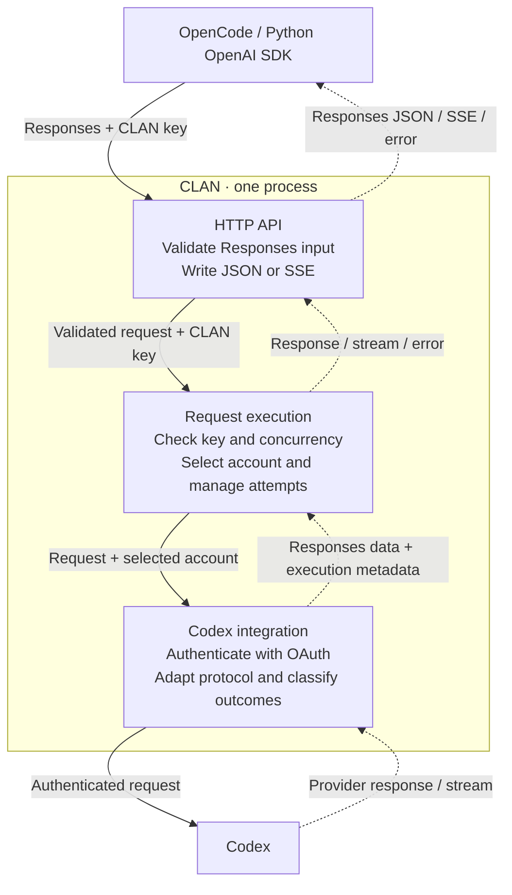

<div align="center">


<p><strong>A self-hosted gateway that turns your Codex subscriptions into one OpenAI Responses endpoint with named, revocable keys.</strong></p>

[](https://github.com/deyna256/clan/actions/workflows/ci.yml)
[](go.mod)
[](LICENSE)
[](#status)

[Quick start](#quick-start) · [Status](#status) · [How it works](#request-flow) · [Scope](#first-release) · [Docs](#documentation) · [Contributing](CONTRIBUTING.md)

</div>

---

## Why CLAN

- **One sign-in, many clients.** Connect a Codex account once through browser OAuth.
  OpenCode, scripts and teammates use CLAN keys instead of personal credentials.
- **Several accounts act as one.** Requests go round-robin to the accounts that serve
  the requested model. Accounts that hit provider limits sit out until they recover.
- **Access you can take back.** Every key has a name and a concurrency limit.
  Revoking a key cancels its running requests at once. Provider tokens never leave
  the server.
- **Nothing else to run.** One Go binary and one SQLite file. No Redis, no separate
  database server, no web panel to maintain.

## Highlights

<table>
<tr>
<td width="50%" valign="top">

**🔌 Drop-in for Responses clients**<br>
`POST /v1/responses` and `GET /v1/models`. Point the OpenAI SDK at CLAN's base URL
and keep your code.

</td>
<td width="50%" valign="top">

**🔄 Account pool**<br>
Connect several Codex accounts. CLAN combines their model catalogs and routes each
request to an eligible account.

</td>
</tr>
<tr>
<td valign="top">

**🔑 Named keys with limits**<br>
One key per app or person. The secret is shown once and stored as a hash. A full key
gets an immediate `429` rather than waiting in a queue.

</td>
<td valign="top">

**🌊 Faithful streaming**<br>
Complete JSON or SSE. Event order is preserved and the terminal status is explicit;
CLAN never invents a completion.

</td>
</tr>
<tr>
<td valign="top">

**🧰 Tools and reasoning pass through**<br>
Function definitions, calls, argument fragments, results and encrypted reasoning
keep their `call_id` and order. Tools run in your client.

</td>
<td valign="top">

**🔒 Secrets stay secret**<br>
OAuth tokens are encrypted with AES-256-GCM before they reach SQLite. Credentials
and request content never appear in logs.

</td>
</tr>
<tr>
<td valign="top">

**🛠 Admin API with OpenAPI**<br>
Accounts, keys and models under `/api`, behind a separate admin token. The schema
is served at `/api/openapi.json`.

</td>
<td valign="top">

**📦 One process, predictable shutdown**<br>
Pure-Go SQLite with no CGO, structured JSON logs, and a graceful stop that lets
running work release its resources.

</td>
</tr>
</table>

## Quick start

You need the Go version from [`go.mod`](go.mod), `openssl` and a Codex subscription.
Docker packaging is in progress ([#35](https://github.com/deyna256/clan/issues/35)).

**1. Build and start the gateway.** Generate two secrets once and keep them private.
Restarts need the same encryption key, otherwise stored credentials cannot be read.

```sh
git clone https://github.com/deyna256/clan && cd clan
go build -o .local/clan ./cmd/clan

openssl rand -hex 32      # use as CLAN_ADMIN_TOKEN
openssl rand -base64 32   # use as CLAN_ENCRYPTION_KEY

export CLAN_ADMIN_TOKEN=... CLAN_ENCRYPTION_KEY=...
.local/clan               # serves 127.0.0.1:8080, stores state in ./clan.db
```

**2. Connect a Codex account.** In a second shell with `CLAN_ADMIN_TOKEN` exported,
start a login, then open the returned `authorization_url` in your browser.

```sh
curl http://127.0.0.1:8080/api/oauth/login \
  -H "Authorization: Bearer $CLAN_ADMIN_TOKEN" \
  -H 'Content-Type: application/json' \
  -d '{"name":"Primary"}'
```

**3. Create a client key.** Save the returned `key`: CLAN shows it only once.

```sh
curl http://127.0.0.1:8080/api/client-keys \
  -H "Authorization: Bearer $CLAN_ADMIN_TOKEN" \
  -H 'Content-Type: application/json' \
  -d '{"name":"My laptop","concurrency_limit":3}'
```

**4. Generate.** Use any model ID from `GET /v1/models`.

```python
from openai import OpenAI

client = OpenAI(base_url="http://127.0.0.1:8080/v1", api_key="<CLAN key>", max_retries=0)
reply = client.responses.create(model="MODEL_ID", input="Say hello.", store=False)
print(reply.status, reply.output_text)
```

Check `status` before using the output: HTTP 200 also covers `incomplete` and
`failed` responses. [Running CLAN](docs/running.md) covers configuration, remote
sign-in and shutdown. The [client contract](docs/client-contract.md#opencode) has
the OpenCode configuration.

## Status

The gateway runs locally end to end. Six of eight first-release milestones are done.

| Milestone | State |
|---|---|
| SQLite storage for accounts and client keys | ✅ [#29](https://github.com/deyna256/clan/issues/29) |
| Codex generation and model discovery | ✅ [#31](https://github.com/deyna256/clan/issues/31) |
| Browser OAuth sign-in and token refresh | ✅ [#30](https://github.com/deyna256/clan/issues/30) |
| Request execution: key limits, account selection, safe retries | ✅ [#32](https://github.com/deyna256/clan/issues/32) |
| Management API | ✅ [#33](https://github.com/deyna256/clan/issues/33) |
| Responses gateway and client model list | ✅ [#34](https://github.com/deyna256/clan/issues/34) |
| Persistent Docker installation | 🚧 [#35](https://github.com/deyna256/clan/issues/35) |
| Acceptance with OpenCode and the OpenAI Python SDK | 🚧 [#36](https://github.com/deyna256/clan/issues/36) |

**Checked live against Codex:** browser sign-in, encrypted persistence, token
refresh and model discovery; JSON and SSE generation, full-history replay, a function
loop with argument fragments, JSON Schema and `json_object` output, and cancellation
during a stream.

**Not yet checked:** image input, opaque reasoning replay, the remaining tool-choice
and text-format variants, and callback forwarding for remote and Docker installations.
Details are in the [recorded checks](docs/client-contract.md#checks-so-far).

## Request flow

This diagram shows runtime flow inside one process, not Go package dependencies.
Solid arrows carry requests; dashed arrows carry responses.



Responses is the reference content format. Execution uses small metadata values
without parsing messages or tool arguments. The Codex integration handles protocol
differences; there is no separate universal message or event model.

## First release

This is the agreed scope. [Status](#status) shows what is implemented and verified.

| Area | Scope |
|---|---|
| Clients | OpenCode and Python applications using the OpenAI SDK |
| Client API | `POST /v1/responses` for generation; `GET /v1/models` for available models |
| Integration | Codex subscription access through built-in OAuth sign-in |
| Generation | Text, instructions, client-supplied history, image input including screenshots, JSON and JSON Schema output, reasoning settings and continuation data |
| Tools | Function definitions, calls, JSON argument fragments and results; tools run in the client |
| Responses | Complete JSON responses and SSE streaming |
| Accounts | One or more Codex accounts; round-robin for the requested model; temporarily exclude accounts with exhausted provider limits |
| Client access | Separate named keys for applications or people, with shared access to connected accounts and available models |
| Limits | Concurrent requests per key, with immediate rejection when full |
| Management | HTTP JSON API under `/api`, protected by a separate admin token |
| Storage | SQLite for accounts, encrypted OAuth credentials, access-key hashes and settings |
| Diagnostics | Structured JSON logs with outcomes, safe errors, account switches and known token usage |
| Deployment | One Go process or container per installation |

Clients supply conversation history with each request. CLAN does not support
provider-stored responses or continuation through `previous_response_id`, and
does not keep its own stored responses for later retrieval.

For Codex compatibility, CLAN removes `max_output_tokens` and logs a warning.
The requested output limit is not enforced. See the
[client contract](docs/client-contract.md) for setup and acceptance checks.

Revoking a client key blocks new requests and cancels its active requests.
Retries keep the same concurrency slot; resources are closed before the slot
is released. Known token usage is diagnostic data, not a token budget.

The [architecture](docs/architecture.md) defines management operations, OAuth setup
and remaining integration checks.

<details>
<summary><strong>Outside the first release</strong></summary>

- Chat Completions, Anthropic and Gemini APIs; other upstream integrations and
  API-key authentication to providers.
- Provider-native tools (web search, code execution, image generation and hosted
  MCP), custom/freeform tools, namespaces and tool search.
- WebSocket, background generation, stored responses, Conversations, Files,
  Containers, Vector Stores and separate compact/count operations.
- Per-key account/model permissions, RPM limits, token or monetary budgets,
  database request history and usage reports.
- PostgreSQL, multiple active gateway instances, a web panel, auth-file imports
  and additional OAuth connection methods.

These exclusions do not commit the project to a later delivery date.

</details>

## Principles

- **Free and open forever.** All features are free and open source, with no paid
  tiers or proprietary editions.
- **Small working scope.** Complete the supported client scenarios before adding
  more protocols, tools or infrastructure.
- **Predictable behavior.** Preserve supported request meaning. Retry only when
  safe, and report unsupported operations explicitly.
- **Owner control.** Administrators manage connected accounts and client access.
  Credentials and request content stay out of logs.
- **Clear failures.** Report safe error details and distinguish unknown consumption
  from zero.

## Documentation

| I want to… | Read |
|---|---|
| Start the gateway and connect an account | [Running CLAN](docs/running.md) |
| Connect OpenCode or the Python SDK and check compatibility | [Client contract](docs/client-contract.md) |
| Manage accounts, client keys and model lists | [Management API](docs/management-api.md) |
| Understand modules, management and open questions | [Architecture](docs/architecture.md) |
| Write and review Go code and tests | [Development guide](docs/development.md) |
| Open an issue or PR, or update documentation | [Contributing](CONTRIBUTING.md) |
| Check community rules | [Code of Conduct](CODE_OF_CONDUCT.md) |

<details>
<summary><strong>Decision log</strong></summary>

These are accepted design decisions. Their status does not imply implementation.

| Record | Decision |
|---|---|
| [0001 — Use Go](docs/decisions/0001-use-go.md) | Application language |
| [0002 — Use Responses as the content format](docs/decisions/0002-use-responses-as-content-format.md) | Responses content and small execution metadata |
| [0003 — Separate execution from protocols](docs/decisions/0003-separate-request-execution-from-protocols.md) | Attempt ownership, concurrency, cancellation and streaming |
| [0007 — Use SQLite](docs/decisions/0007-use-sqlite.md) | Persistent configuration and secret storage |
| [0014 — Use chi](docs/decisions/0014-use-chi-for-http-routing.md) | HTTP routing over `net/http` |

</details>

**Built with** Go and `net/http`, [chi](https://github.com/go-chi/chi) for routing,
[Huma](https://github.com/danielgtaylor/huma) for the management OpenAPI contract and
[modernc SQLite](https://gitlab.com/cznic/sqlite).

## Responsible use

CLAN is an independent project and is not affiliated with OpenAI. Connect only
accounts you are allowed to use, and make sure the way you share access follows
your provider's terms.

## Contributing

Issues and pull requests are welcome. Read [CONTRIBUTING.md](CONTRIBUTING.md) for
the issue format, branch and commit rules, and the checks to run. Working notes
belong in the ignored `.local/` directory; see
[local working documents](CONTRIBUTING.md#local-working-documents).

## License

[MIT](LICENSE) © 2026 Ivan Deyna
