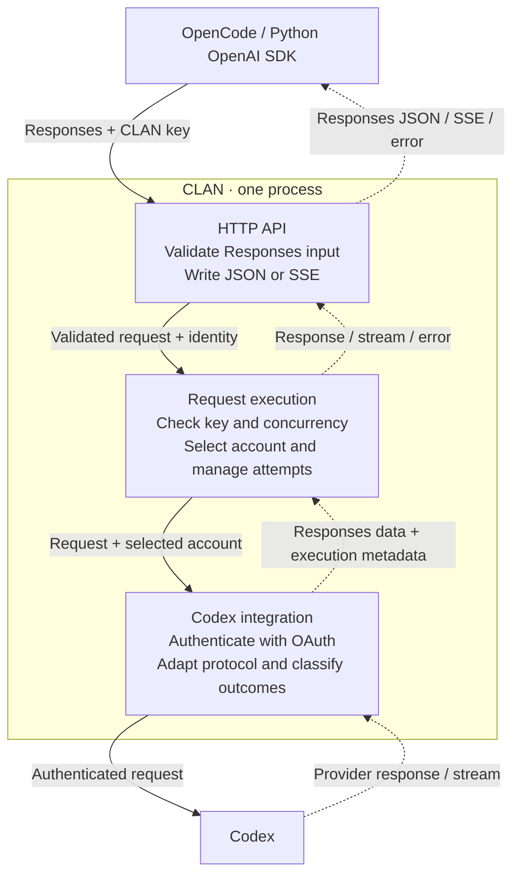

<h1>CLAN</h1>

<strong>Cooperative LLM Access Network</strong>

---

CLAN is a self-hosted LLM gateway. The first release will connect OpenCode and
Python applications using the OpenAI SDK to Codex subscriptions through OAuth.
Clients use CLAN access keys; CLAN manages the Codex accounts.

> **Status:** design and foundation code. The gateway is not yet runnable.
> The scope below describes the agreed first release, not completed functionality.

**Language:** Go. Its concurrency support and standard HTTP library fit simultaneous
requests, streaming and cancellation.

**HTTP:** `net/http.Server` with [chi](https://github.com/go-chi/chi) for routing.

## Principles

- **Free and open forever.** All features are free and open source, with no paid
  tiers or proprietary editions.
- **Small working scope.** Complete the supported client scenarios before adding
  more protocols, tools or infrastructure.
- **Predictable behavior.** Preserve supported request meaning. Retry only when
  safe, and report unsupported operations explicitly.
- **Owner control.** Administrators manage connected accounts and client access.
  Credentials and request content stay out of logs.
- **Clear failures.** Report safe error details and distinguish unknown consumption
  from zero.

## First release

| Area | Scope |
|---|---|
| Clients | OpenCode and Python applications using the OpenAI SDK |
| Client API | `POST /v1/responses` for generation; `GET /v1/models` for available models |
| Integration | Codex subscription access through built-in OAuth sign-in |
| Generation | Text, instructions, client-supplied history, image input including screenshots, JSON and JSON Schema output, reasoning settings and continuation data |
| Tools | Function definitions, calls, JSON argument fragments and results; tools run in the client |
| Responses | Complete JSON responses and SSE streaming |
| Accounts | One or more Codex accounts; round-robin for the requested model; temporarily exclude accounts with exhausted provider limits |
| Client access | Separate named keys for applications or people, with shared access to connected accounts and available models |
| Limits | Concurrent requests per key, with immediate rejection when full |
| Management | HTTP JSON API under `/api`, protected by a separate admin token |
| Storage | SQLite for accounts, encrypted OAuth credentials, access-key hashes and settings |
| Diagnostics | Structured JSON logs with outcomes, safe errors, account switches and known token usage |
| Deployment | One Go process or container per installation |

Clients supply conversation history with each request. CLAN does not support
provider-stored responses or continuation through `previous_response_id`, and
does not keep its own stored responses for later retrieval.

Revoking a client key blocks new requests and cancels its active requests.
Retries keep the same concurrency slot; resources are closed before the slot
is released. Known token usage is diagnostic data, not a token budget.

The [architecture](docs/architecture.md) defines management operations, OAuth setup
and remaining integration checks.

## Request flow

This diagram shows runtime flow inside one process, not Go package dependencies.
Solid arrows carry requests; dashed arrows carry responses.

Responses is the reference content format. Execution uses small metadata values
without parsing messages or tool arguments. The Codex integration handles protocol
differences; there is no separate universal message or event model.

## Outside the first release

- Chat Completions, Anthropic and Gemini APIs; other upstream integrations and
  API-key authentication to providers.
- Provider-native tools (web search, code execution, image generation and hosted
  MCP), custom/freeform tools, namespaces and tool search.
- WebSocket, background generation, stored responses, Conversations, Files,
  Containers, Vector Stores and separate compact/count operations.
- Per-key account/model permissions, RPM limits, token or monetary budgets,
  database request history and usage reports.
- PostgreSQL, multiple active gateway instances, a web panel, auth-file imports
  and additional OAuth connection methods.

These exclusions do not commit the project to a later delivery date.

## Documentation

| I want to… | Read |
|---|---|
| Understand modules, management and open questions | [Architecture](docs/architecture.md) |
| Write and review Go code and tests | [Development guide](docs/development.md) |
| Open an issue or PR, or update documentation | [Contributing](CONTRIBUTING.md) |
| Check community rules | [Code of Conduct](CODE_OF_CONDUCT.md) |

Working notes belong in the ignored `.local/` directory; see
[local working documents](CONTRIBUTING.md#local-working-documents).

### Decision log

These are accepted design decisions. Their status does not imply implementation.

| Record | Decision |
|---|---|
| [0001 — Use Go](docs/decisions/0001-use-go.md) | Application language |
| [0002 — Use Responses as the content format](docs/decisions/0002-use-responses-as-content-format.md) | Responses content and small execution metadata |
| [0003 — Separate execution from protocols](docs/decisions/0003-separate-request-execution-from-protocols.md) | Attempt ownership, concurrency, cancellation and streaming |
| [0007 — Use SQLite](docs/decisions/0007-use-sqlite.md) | Persistent configuration and secret storage |
| [0014 — Use chi](docs/decisions/0014-use-chi-for-http-routing.md) | HTTP routing over `net/http` |
