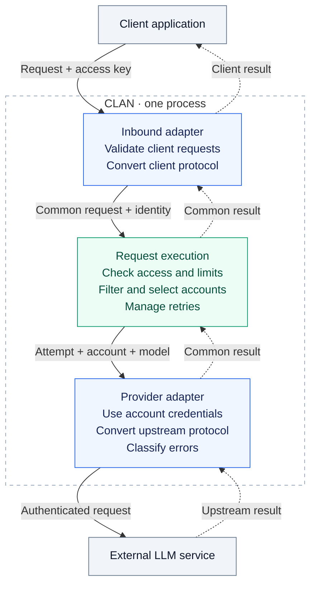

<h1>CLAN</h1>

<strong>Cooperative LLM Access Network</strong>

<em>One account hits its limit — the next one picks up.</em>

---

CLAN is a self-hosted gateway for your LLM accounts, including CLI subscriptions
and API keys. Its initial client API supports OpenAI Chat Completions and Responses.

Administrators configure external LLM services (upstreams), connect accounts, and
issue access keys that control which services applications and people can use.

CLAN chooses an account for the requested model and upstream. After a failure known
to allow retry, it can try another allowed account before the client response begins.
It does not resend requests whose upstream outcome is unknown.

**Language:** Go. Its concurrency support and standard HTTP library suit a gateway
handling simultaneous requests, long-lived streams, and cancellation.

**HTTP:** `net/http.Server` with [chi](https://github.com/go-chi/chi) for routing
and middleware groups. Handlers use standard `net/http` types.

> **Status:** early. The design is still being worked out and there is no usable build yet.

See the [documentation](#documentation) for development guides and accepted decisions.

## Principles

- **Free and open forever.** CLAN and all its features will always be free and open
  source, with no paid tiers or proprietary editions.
- **Owner control.** The operator controls deployment, connected accounts, allowed
  destinations, and how long data is kept. Secrets and request content stay out of default logs.
- **Predictable behavior.** Switching models, falling back to a paid API, or changing
  what a request means requires explicit configuration. Retries are limited and
  allowed only when the request can safely be sent again.
- **Faithful compatibility.** Preserve streaming, tool calls, and model options for
  supported integrations. Document what each integration supports and reject unsupported
  behavior rather than silently dropping it.
- **Explainable decisions.** Show why an account was selected or excluded and what
  happened on each attempt. Distinguish observed limits from estimates and unknowns.
- **Simple operation.** Keep setup, configuration, and required infrastructure small.
  Provide errors that help users fix the problem, and safe defaults.

## Confirmed scope

This is the agreed product scope. Some core modules are implemented; the gateway
is not yet usable.

| Area | Initial scope |
|---|---|
| Client APIs | OpenAI Chat Completions and Responses, available simultaneously |
| Upstream integrations | Codex OAuth; Claude OAuth/API keys; OpenAI-compatible and Anthropic-compatible services through a base URL and API key, including [MiniMax](https://platform.minimax.io/docs/api-reference/text-anthropic-api) |
| Accounts and routing | Accounts belong to upstreams. Choose an allowed account for the requested model using round-robin; check access on every attempt |
| Failover | Limit retries to failures that allow them. Never silently restart a response or resend a request whose outcome is unknown |
| Access keys | Separate keys for applications and people, restricted by upstream and model; any eligible account in the permitted upstream may serve the request |
| Limits | Request-rate limits with token-bucket bursts, concurrent client requests, and token budgets over independent fixed 5-hour and 7-day windows |
| Consumption | Count known input/output tokens, including failed attempts; show when usage is unknown. An attempt that passes budget checks may finish over budget |
| History | Request outcomes, separate attempts, account status and safe failure details; one year of configurable retention and reports computed on demand |
| Management | HTTP JSON API under `/api`, with a separate admin token. Generate OpenAPI from Go and publish it through a dedicated endpoint |
| Model discovery | Expose models permitted by the caller's access key. OpenCode and Codex are required clients; discovery behavior depends on the client |
| Storage | SQLite by default; PostgreSQL selected through environment configuration, with the same application features and no silent fallback |
| Deployment | One process or container per installation, handling concurrent requests |
| Secrets | Show access keys once, then store only hashes for checking them. Encrypt upstream credentials with a key kept outside the database |

An upstream's integration type and an account's upstream are fixed at creation.

Changing an access key's permissions requires disabling it and completing local
request cleanup. Its name and limits can change while the key is enabled.

The web panel will be delivered from a separate repository. This repository provides
its backend API. Request bodies, model responses and individual stream chunks are
not stored by default. Recording these contents is outside the initial scope.

Each integration will list the operations it supports and any client limitations.
See the [accepted ADRs](#decision-log) for exact contracts and trade-offs,
including budget overruns, incomplete history and possible loss of unsaved usage on a crash.

## Request flow

The planned request path runs inside one CLAN process. Solid arrows show outgoing
requests; dashed arrows show results returning to the client. These are runtime
flows, not Go package dependencies.

A result is a complete response, a stream or an error. Internally, streaming uses
shared `Event` values through `Next`/`Close`. Validation or admission can reject a
request before it reaches the upstream.

Request execution selects eligible accounts with round-robin and owns retries,
cancellation, timeouts, token accounting and attempt history. Each attempt keeps
the requested model and the caller's access rules. See
[ADR 0003](docs/decisions/0003-separate-request-execution-from-protocols.md) for the
full contract.

## Deferred

Anthropic Messages as a client API and direct Claude Code support are deferred.
This does not remove Anthropic-compatible upstreams from the integration scope.

Provider background generation is outside the current scope. Requests to start it
are rejected explicitly; ordinary responses and streaming remain supported targets.

WebSocket steering and its automatic continuations are deferred. Explicit
`response.create` requests remain in scope.

Gemini on both API sides, named account pools, model aliases or automatic model
switching, additional selection strategies, cost tracking and USD budgets,
and multiple active gateway instances are outside the initial scope.

## Documentation

| I want to… | Read |
|---|---|
| Understand the modules and request flow | [Architecture](docs/architecture.md) |
| Write and review Go code and tests | [Development guide](docs/development.md) |
| Open an issue or PR, or write documentation | [Contributing](CONTRIBUTING.md) |
| Use storage and run database tests | [Storage setup](docs/storage.md) |
| Check the OpenAI provider adapter's operations and ownership rules | [OpenAI adapter](docs/openai-adapter.md) |
| Check community rules | [Code of Conduct](CODE_OF_CONDUCT.md) |

Working notes belong in the ignored `.local/` directory; see
[local working documents](CONTRIBUTING.md#local-working-documents).

### Decision log

| Record | Status | What it decides |
|---|---|---|
| [0001 — Use Go](docs/decisions/0001-use-go.md) | Accepted | Application language |
| [0002 — Common typed representation](docs/decisions/0002-use-common-request-format.md) | Accepted | Common internal request, response and event types |
| [0003 — Execution and protocol adapters](docs/decisions/0003-separate-request-execution-from-protocols.md) | Accepted | Protocol adapters, execution ownership and Next/Close stream contract |
| [0004 — Replaceable account selection](docs/decisions/0004-use-replaceable-account-selection.md) | Accepted | Round-robin with a replaceable selection contract |
| [0005 — Account and credential types](docs/decisions/0005-encapsulate-credential-types-in-account.md) | Accepted | Account credential variants and OAuth renewal before dispatch |
| [0006 — Management API](docs/decisions/0006-provide-management-api-without-bundled-ui.md) | Accepted | Management resources, admin access and Go-generated OpenAPI |
| [0007 — Storage backends](docs/decisions/0007-support-sqlite-and-postgresql.md) | Accepted | Two database backends, one gateway instance and secret storage |
| [0008 — Token-budget enforcement](docs/decisions/0008-enforce-token-budgets-at-admission.md) | Accepted | Token windows, observed usage, overruns and accounting failures |
| [0009 — Request history](docs/decisions/0009-record-request-and-attempt-history.md) | Accepted | Request/attempt history, retention, reporting and recovery |
| [0010 — Client-request concurrency](docs/decisions/0010-limit-concurrent-client-requests.md) | Accepted | One slot per active client request; reject without queuing |
| [0012 — Retry policy](docs/decisions/0012-retry-classified-transient-failures.md) | Accepted | Retry eligibility, attempt/wait limits and Retry-After |
| [0013 — Timeout policies](docs/decisions/0013-separate-ordinary-and-streaming-timeouts.md) | Accepted | Separate overall, startup, inactivity and write timeouts |
| [0014 — HTTP routing](docs/decisions/0014-use-chi-for-http-routing.md) | Accepted | chi over net/http, route groups and standard handlers |
| [0015 — Token-bucket rate limits](docs/decisions/0015-use-token-bucket-rate-limits.md) | Accepted | Sustained request rate and burst capacity, counted once per client request |
