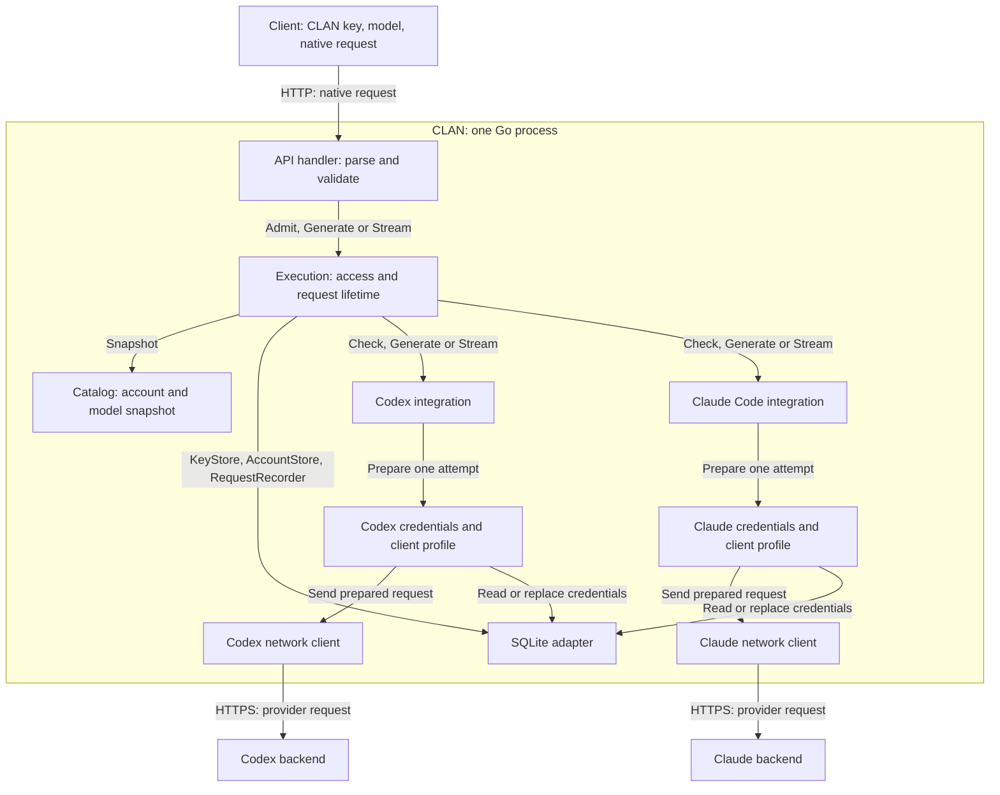

# Provider design

Status: Proposed. Updated: 2026-10-05.

This document explains how to add providers while sharing CLAN's request handling.
It is for contributors implementing and reviewing the change.
[Architecture](architecture.md) describes the code today; the
[roadmap](roadmap.md) sets delivery order and completion checks.

## Problem and scope

Execution currently depends directly on Codex, its OAuth manager and SQLite.
Adding Claude Code or Jev without changing these dependencies would spread
provider rules through shared code or require copying that code.

The target is native model APIs with shared access, limits, cancellation and
records. Existing Codex clients, accounts, keys and history must keep working.
Running agents and tools, automatic session transfer and multiple active gateway
instances are outside this change. A common format comes later.

## Decisions

Keep one process and wire dependencies at startup. Add shared code with the
second real integration. The main choices and their costs are:

| Choice | Why | Cost or alternative |
|---|---|---|
| Native APIs first | Preserve each provider's format and features | Clients must use different formats. A common format now would require conversions before we know the needed scope. |
| One execution path, separate provider operations | Reuse policy while allowing JSON-only, streaming and different authentication methods | Several small interfaces replace direct calls. One large provider interface would force unused methods. |
| Storage interfaces owned by their callers | Test execution without SQLite and keep secrets out of it | Domain records and storage errors must be separated. Keeping concrete storage would preserve the current coupling. |
| Explicit startup registration | Make supported operations clear without a plugin loader or base provider type | Adding an integration requires a new build. |

Session binding favors correct continuation over account failover: a bound
session can become unavailable when its account is unavailable. Tested client
profiles require ongoing checks as original clients change.

## Responsibilities and dependencies

| Part | Owns |
|---|---|
| Client API | Read keys and requests; validate the API format; write responses and errors |
| Execution | Access, limits, account selection, sessions, retries, cancellation and records |
| Integration | Provider checks, credentials, request changes, network clients and failure details |
| Catalog | Cache account model lists and build the public list |
| Storage | Save accounts, encrypted credentials, key hashes and request records |
| Application | Create and connect these parts; start and stop them |

Execution and the catalog define the interfaces they call. Integrations implement
them. Execution also defines its storage interfaces; SQLite implements them.
Execution imports neither provider implementations nor storage implementations.

Shared execution values live in `internal/provider`; account, key and usage
records stay in their domain packages. These values contain no HTTP handlers,
SQL rows or provider SDK objects. Move existing definitions instead of making
copies that must stay in sync.

Content types belong to API formats: Responses, Messages or System One. Two
integrations using Messages share its parser and writer. Execution reads routing
and request metadata, not messages, tool arguments or provider event names.

## Public APIs

Codex generation, model listing and the admin API exist today. Messages, System
One and support for several integrations are planned. Connect accounts through
the admin API before sending model requests.

| Route | Request format | CLAN authentication | Planned integration |
|---|---|---|---|
| `GET /v1/models` | Existing OpenAI model-list format | CLAN key | All integrations |
| `POST /v1/responses` | Responses | Bearer CLAN key | Codex |
| `POST /v1/messages` | Messages | `x-api-key` or Bearer CLAN key | Claude Code |
| `POST /v1/systemone` | System One | Bearer CLAN key | TypeSafe / Jev |
| `/api` | Account, key and usage management | Separate admin token | All integrations |

Reject conflicting client credentials. Never send a CLAN key to a provider.
Connection setup stays separate from model calls: Claude account access and
regular Anthropic API-key access are different integrations.

Model names use `<integration>/<model>`. Each API has a configured default for
names without a prefix; existing Codex names keep working. Catalog changes must
not change that default. Reject unclear routing and never switch providers
automatically. Remove the prefix only from the model sent upstream.

The public model list includes supported APIs and response modes. Extend
`GET /v1/models` without changing its existing response structure; define the
added fields when reviewing the API in roadmap step 2. Use separate routes and
document their base URLs if another model-list format is needed.
Integrations decide which model names and options they accept. A name absent
from the public list is not always invalid, as with versioned Jev names.

## Request flow

The diagram shows runtime calls, not Go imports. Responses return along the same
paths. Boxes inside CLAN are parts of one process. Authentication and network
clients are private parts of each integration, not separate services.



1. The handler parses the native request once. Execution checks the CLAN key and
   reserves its concurrency slot before provider work.
2. Execution resolves the integration and gets its catalog snapshot. The catalog
   loads models on demand through the integration, or uses configured model data.
3. The integration checks the API, model, response mode and options, then returns
   eligible accounts and session rules. It only narrows the snapshot's accounts;
   it makes no network calls and does not select an account or reserve limits.
4. Execution selects an enabled account, applying limits, cooldowns and any session
   binding. Account and session reservations happen together before dispatch.
5. The integration checks current credentials, enabled state and account ownership,
   builds a fresh outgoing request and makes one attempt. A stale snapshot cannot
   authorize a new attempt after disablement or reconnect.
6. The handler sends native JSON or events. Execution may retry only under the
   rules below. After delivery, it closes resources, records the outcome and
   releases the slot.

Keep the checked request unchanged. Each attempt derives its provider body from
that input; one account's changes must not affect another attempt. Copy slices
and maps before changing them. Storage and catalog snapshots follow the same rule.

### Example requests

These use model IDs from the catalog. `X-Clan-Session` is a proposed name for a
client session ID. It is required only where the integration needs session state;
it does not replace conversation history.

```http
POST /v1/responses
Authorization: Bearer <CLAN_KEY>
Content-Type: application/json
X-Clan-Session: codex-session-1

{"model":"codex/<model-id>","input":"Explain this function.","stream":true}
```

```http
POST /v1/messages
x-api-key: <CLAN_KEY>
anthropic-version: 2023-06-01
Content-Type: application/json
X-Clan-Session: claude-session-1

{
  "model": "claude-code/<model-id>",
  "max_tokens": 1024,
  "messages": [{"role":"user","content":"Explain this function."}],
  "stream": true
}
```

The client sends history, runs requested tools and sends their results in later
requests. CLAN does not run the Codex or Claude Code agent in these flows.

## Integration interfaces

These are proposed Go signatures. Imports and value declarations are omitted.
Execution owns these interfaces:

```go
type RequestChecker interface {
    Check(context.Context, provider.Request, provider.CatalogSnapshot) (provider.CheckResult, error)
}

type Generator interface {
    Generate(context.Context, account.Ref, provider.Request) (provider.Result, error)
}

type Streamer interface {
    Stream(context.Context, account.Ref, provider.Request) (provider.Stream, error)
}
```

At startup, require `RequestChecker` and discover `Generator`, `Streamer` or both
with Go type assertions. Reject an integration with neither execution method.
Keep the discovered interfaces; do not switch on provider types per request.
Derive supported modes from these methods, then apply model restrictions in
`Check`. No dummy OAuth or streaming methods are needed.

Model loading has its own catalog callback. Keep provider-specific model details
in its snapshots; only the integration interprets them. Connection setup belongs
to management. Neither is part of the generation interface. An API-key provider
can support JSON, streaming or both; OAuth does not determine the response mode.

| Value | Meaning |
|---|---|
| `provider.Request` | API format, unchanged payload, derived routing and optional scoped session |
| `provider.CatalogSnapshot` | Account metadata and model data for the selected integration |
| `provider.CheckResult` | A subset of those accounts and required account/session limits |
| `account.Ref` | Selected account ID and expected ownership version |
| `provider.Result` | Native JSON, completion status and known usage |
| `provider.Stream` | Native events through `Next`, result/failure inspection and `Close` |
| Failure details | Safe category, upstream status, retry safety and retry time |
| Session binding | CLAN key + integration + client session ID mapped to an account |

Keep known usage available even when an attempt fails. Do not turn unknown usage
into zero. Execution uses common completion and failure facts, not native event
names. The handler encodes errors in the client's API format.

## Request ownership

Separate admission from generation, as proposed in
[#54](https://github.com/deyna256/clan/issues/54):

```go
req, err := executor.Admit(ctx, key, requestInfo, input)
if err != nil {
    // Nothing to close; deliver the admission error.
    return
}
defer req.Close()
result, err := req.Generate() // Or req.Stream().
// Deliver the result or error before closing req.
```

This illustrates the caller flow, not final method signatures. The admitted
request owns cancellation, the slot and delivery flags. The handler marks response
start and delivery failure on it. An attempt error does not change that ownership.
Rejected authenticated requests still use the
[recording rules](decisions/0016-record-request-metadata.md). Apply those rules
to every generation API, with the API and integration recorded where known.
Keep reporting and retention shared.

`Generate` reads and closes its upstream response before returning. It may collect
a provider stream inside the integration, as Codex does. Its result needs no
closer. `Stream` supplies attempt cleanup through `Close`. Both execution modes
use the same admission, selection, retry and finalization code.

One reader calls `Next`. Cancellation interrupts provider and client I/O.
Concurrent `Close` unblocks `Next` without draining the stream. Buffers stay
bounded. EOF alone is not proof of successful completion.

Request close runs finalization once: close the attempt, record the outcome,
release limits and unregister cancellation. A record-write failure is logged;
it does not change a delivered response or keep the slot occupied forever.

## Storage interfaces

Execution defines only the operations it uses:

```go
type KeyStore interface {
    FindAccessKeyByHash(context.Context, accesskey.VerificationHash) (accesskey.State, error)
    RevokeAccessKey(context.Context, accesskey.ID) error
    UpdateAccessKeyConcurrency(context.Context, accesskey.ID, int) error
}

type AccountStore interface {
    GetAccount(context.Context, account.ID) (account.State, error)
    ListAccounts(context.Context) ([]account.State, error)
    EnableAccount(context.Context, account.ID) error
    DisableAccount(context.Context, account.ID) error
    DeleteAccount(context.Context, account.ID) error
}

type RequestRecorder interface {
    InsertRequest(context.Context, usage.RequestRecord) error
}
```

One SQLite store implements all three. Tests can use memory stores. The application
opens and closes storage. Keep SQL errors, migrations, report queries and database
encoding outside execution. Missing reads return `account.ErrNotFound` or
`accesskey.ErrNotFound`, not SQL errors. No generic repository or transaction
interface is needed. Preserve cancellation through `errors.Is`.

Key state contains identity, enabled state and concurrency limit, not the key.
Account state contains identity, integration, enabled state, ownership version
and credential version, not credentials. Keep any provider account ID separate
from the local ID and credential version. Request records add integration, API,
requested/resolved model and profile version to existing outcome data.

Authentication code defines its own credential interfaces:

```go
type CredentialReader interface {
    ReadCredentials(context.Context, account.ID) (account.CredentialSnapshot, error)
}

type CredentialReplacer interface {
    ReplaceCredentialsIfUnchanged(
        context.Context,
        account.CredentialSnapshot,
        account.CredentialData,
    ) (account.CredentialSnapshot, error)
}
```

Static keys need only the reader. Storage encrypts the data; the integration
decodes and validates it. Snapshots include account metadata and credential
versions. Only authentication code receives decrypted snapshots; never expose
them through public APIs or logs.

Replacement checks enabled state, ownership version and credential version in
one atomic write. Disable/re-enable, deletion, reconnect and competing writes
must prevent an old refresh from being saved. Refresh changes credentials but
keeps account ownership, active requests and sessions. Replacing a static key
counts as reconnect, even if the provider exposes no account ID.

Account creation and reconnect use the connection code's write operations, not
the generation storage interface. Account changes and key revocation use the
execution management gate: persist first, clear affected state and cancel work,
then release the gate and wait for cleanup. Failed writes leave running work
unchanged. Re-enabling an account does not restore canceled work or lost sessions.
Private integration state follows the same cleanup rules. Changes to a key's
concurrency limit affect new admissions; they do not cancel active requests.

At shutdown, stop and join active work, close integration clients, then storage.

## Sessions and retries

Use sessions only when needed. Scope each session by CLAN key, integration and
client session ID. One key may have many sessions; its concurrency limit counts
active requests across all APIs and sessions. Execution supplies the scoped
session reference; the integration maps it to provider identifiers. Equal client
session IDs under different keys stay separate.
Do not infer a shared session from matching prompts.

Create a required account binding atomically before the first attempt. Concurrent
requests see the same binding, including after a failed attempt. If the provider
requires ordered turns, allow one active request per session. Reject excess work
without queuing. The integration owns continuation tokens and connections.

The session API must distinguish starting a session from continuing one. Define
that signal from the native request and session reference before publishing the
API. Missing server state alone must not turn continuation into a new session.
Limit stored sessions and idle time. Never evict an active session. After expiry
or restart, reject continuation if its account or required state is lost. Do not
silently move a bound session to another account.

A future explicit restart on another account may use client-supplied history only
if the integration can verify it has all required state. That creates a new
provider session; it does not transfer connections, caches or account identity.

Balance new sessions and independent calls across eligible accounts. Only
execution retries generation: at most three attempts on different accounts for
unbound calls; one attempt per client request for bound sessions. Close resources
before retrying. The integration reports whether a failure affects one account
or the provider as a whole. Switch accounts only for account-specific failures
known to allow a safe repeat. Never retry an unknown outcome or after client
response start. HTTP 429 alone does not justify switching accounts. Token refresh
has separate retry rules.

## Client profiles and provider details

A client profile names a tested version and platform, with its headers, body rules
and network settings. Start with one profile in each account integration's code.
Use standard HTTP unless comparisons show a need for different TLS, compression,
header order or WebSockets. Login, discovery and generation may use different
network clients.

Keep required client identifiers stable across token refresh. Incoming headers
cannot overwrite the trusted profile. Clear session state that cannot work after
a profile update. Preserve instructions, tool arguments and results; reject
unsupported content instead of changing its meaning. Record checked differences
and repeat comparisons when updating the profile.

Use TLS with certificate checks for remote connections. Keep secrets and content
out of logs, request records and shared captures; use controlled test content for
comparisons. Matching a tested profile does not prove that traffic is impossible
to distinguish. Review the connection method before enabling account access, as
required by roadmap step 1.

Regular API integrations need no client profile. TypeSafe/Jev uses its
[native JSON API](https://docs.typesafe.ai/api), with `state` and `questions` in,
`answers` and usage out. `state` is content, not a session ID. Follow its
[model rules](https://docs.typesafe.ai/models), including accepted versioned IDs.

Cache model data per account. Reject in-flight results using old credentials;
changing account ownership also discards its cached list. Temporary discovery
failures retain valid last-known data under the existing catalog rules.

## Adding an integration

Add its code, startup registration, connection setup and tests. Add an API handler
only for a new format. Reuse format parsers/writers, encryption, conditional
writes and retry-time parsing where the rules match. Do not copy access checks,
limits or finalization into integrations.

An integration that fits the contracts should not change shared policy. New
protocol needs may require a reviewed contract change. A future common API
converts requests, responses, events and errors through the same execution path.
Reject unsupported conversions. Add cache usage counters and token-counting calls
when those features are needed; token counting must share limits and cancellation.

The [roadmap](roadmap.md) defines delivery checks. Contract tests must also cover
two integrations sharing one API, API-key streaming, a valid unlisted model,
unchanged input across retries and the same storage rules in memory and SQLite.
Test real adapters as well as fakes. No live compatibility claim follows from
interface definitions alone.

## Open decisions and checks

| Question | Resolve before |
|---|---|
| Which Claude connection method, client version and platform can we support? | Claude account access, using the evidence from roadmap step 1 |
| Which Codex version and network behavior will we match? | Profile changes, using roadmap step 5 |
| How do clients identify, start and continue sessions, including after restart? | Publishing the session API in step 3 |
| What are the final model-list fields? | Publishing the model API in steps 2–3 |

The Go signatures describe the intended boundaries; they are not implemented or
type-checked contracts yet. Validate them with real integrations and review the
package graph for unwanted dependencies. Examples are not released API promises.

Review and update [ADR 0002](decisions/0002-use-responses-as-content-format.md),
[ADR 0003](decisions/0003-separate-request-execution-from-protocols.md) and
[ADR 0016](decisions/0016-record-request-metadata.md) before merging changes to
their rules. Once implemented, link to actual Go contracts instead of maintaining
a second copy of their signatures here. This proposal replaces local design drafts.

Documentation guidance: [arc42](https://arc42.org/overview/) for scope and views,
[C4](https://c4model.com/diagrams/checklist) for clear diagrams,
[ADRs](https://cognitect.com/blog/2011/11/15/documenting-architecture-decisions) for
decisions and consequences, and [Rust RFCs](https://github.com/rust-lang/rfcs/blob/main/0000-template.md)
for alternatives and open questions.
